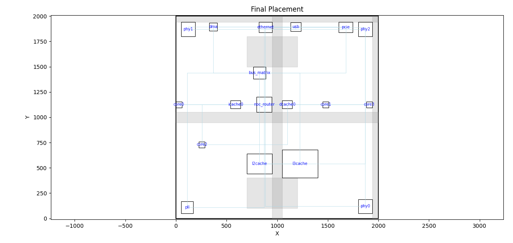
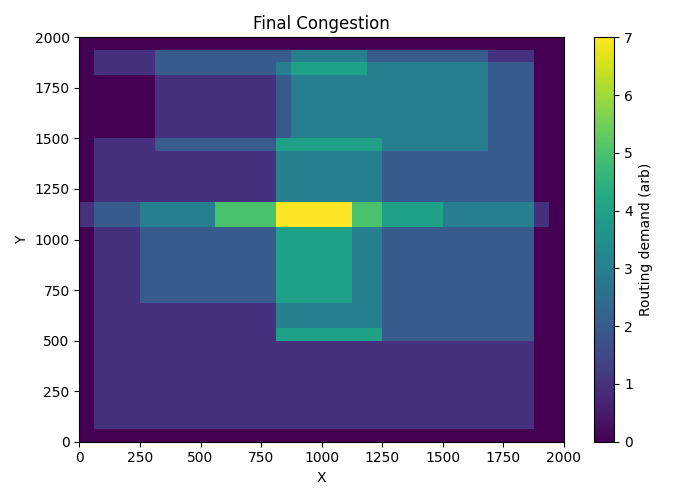

# mini_vlsi_placement_tool

# VLSI Placement Optimization

## Overview

This project implements a comprehensive VLSI placement flow, including global placement, legalization, and refinement algorithms to optimize cell locations on a chip. The goals are to minimize total wirelength, reduce congestion, and respect density and blockage constraints essential for high-quality physical design.

---

## Features

- Quadratic global placement for initial cell positioning
- Recursive bisection partitioning considering blockages
- Simulated annealing for local refinement
- Multi-objective cost balancing wirelength, congestion, and blockage penalties
- Visualization tools for layout and congestion heatmaps

-         

---

## Prerequisites

- Python 3.7 or higher
- Packages: `numpy`, `scipy`, `matplotlib`

Install dependencies via pip:
`pip install numpy scipy matplotlib`

---

## Usage

### Clone repository

`git clone https://github.com/ridash2005/mini_vlsi_placement_tool.git
cd vlsi-placement-optimization`

### Run placement
`python main.py`

This runs the full placement flow with default parameters including visualization of the final placement and congestion heatmap.

### Customize parameters

You can customize various aspects of the placement process, including:

Chip dimensions and netlist: Modify input.py to change chip width, height, and netlist details to match your design specifications.

Cost function weights: Adjust the relative weights for wirelength, density overflow, blockage penalty, and clustering penalty in cost.py to prioritize different optimization objectives.

Annealing iterations: Set the number of simulated annealing iterations (anneal_iters) to control the refinement duration and solution quality.

Partitioning and randomness: Customize the number of partitions, balance tolerance, and random seed for deterministic or varied runs.

Visualization: Enable or disable visual output with the visualize flag.

---

## Output

- Final cell placements (coordinates)
- Wirelength and congestion metrics
- Visual plots of chip layout and routing congestion

---

## Project Structure

- `input.py` - Input netlist and blockage generation  
- `data.py` - Core data structures (Cells, Nets, Params)  
- `parser.py` - Netlist parsing and initial placement  
- `cost.py` - Cost functions for wirelength, density, blockage  
- `global_placement.py` - Quadratic global placement algorithm  
- `partitioning.py` - Recursive bipartitioning with blockage awareness  
- `annealing.py` - Simulated annealing refinement  
- `visualize.py` - Plotting utilities for chip layout and congestion  
- `run_placement.py` - Main executable placement flow

---

## License

This project is licensed under the MIT License. See the LICENSE file for details.

---

## Contact

For questions or contributions, please open an issue or submit a pull request.

